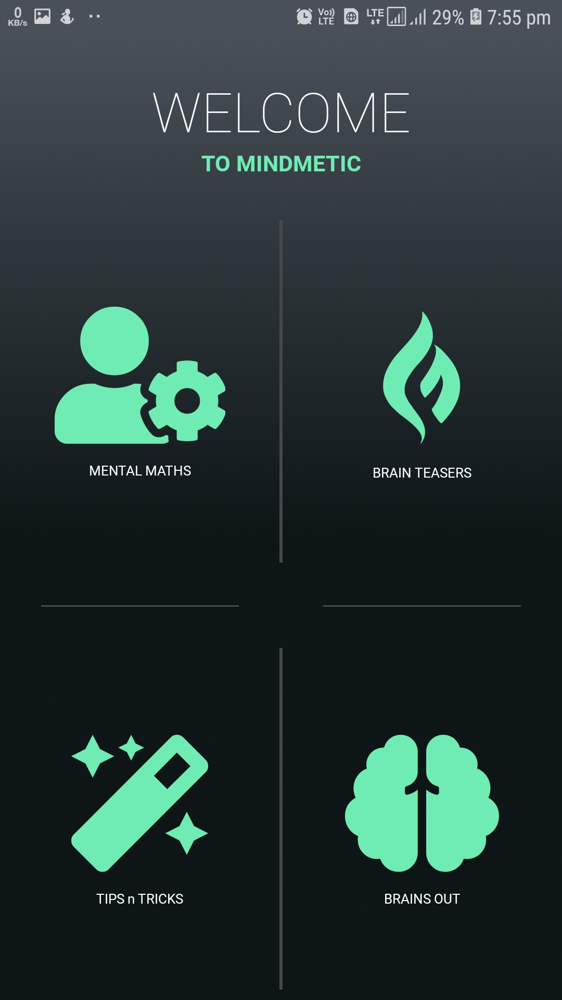
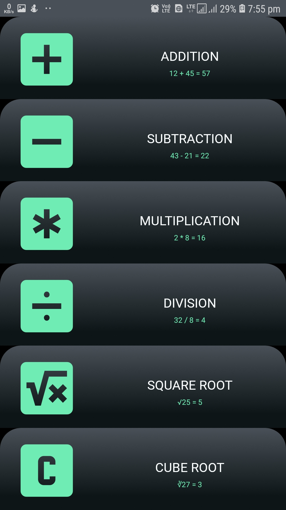

# Mindmetic

Who Knew math could be so much fun?  

Get ready to entertain your family, friends and teachers with some amazing maths!

You and your pals are going to laugh it up and learn lots of cool stuff in the process.
 

Just remember to use your head---

<h3>Your brain is the best problem-solving machine ever!</h3> 

So what are you waiting for?

<h3>Get started !</h3>
<!-- <a href="https://www.dropbox.com/s/ln463aq5ijwa5cq/Diner.apk?dl=0">DOWNLOAD THE APP</a>  -->
FRONT END : React-Native  
 

  

